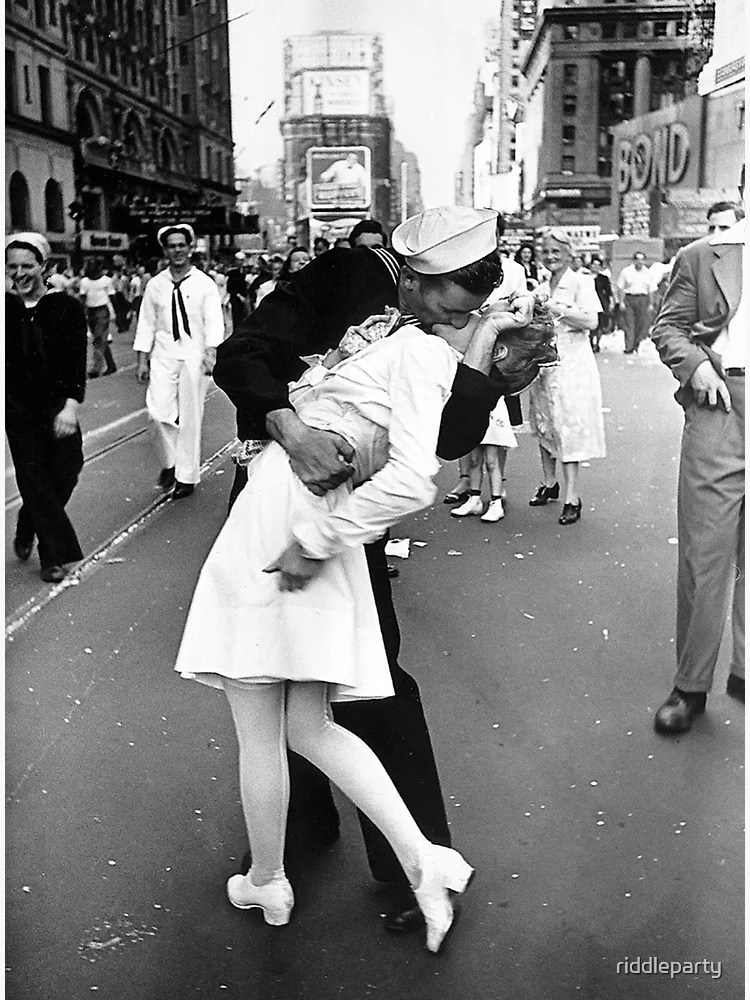

# Puzzle Cheat

🚨 Experimental project 🚨

Cheat at the puzzle game by taking a photo of the piece(s) (it can be already assembled).

## Installation

Run a virtual environment and install the requirements.

```bash
pip install -r requirements.txt
```

## Usage

1. Take a photo of the puzzle image (on internet, with good quality).
2. Take a photo of the piece (or multiple pieces already assembled).
3. The app will tell you the zones where the piece can be placed (I hope ^^).


For exemple :
```bash
python ./run.py --puzzle-image-path ./puzzle_image.jpg --piece-image-path ./piece_image.jpg --number-assembly-pieces 2
```

You can use `-h` to see the help.

## Result   

From this :     


Result :    


## How does it work technically?

1. Remove the background from the piece(s) image.
2. Rotate the piece(s) image.
3. Rescaling the puzzle piece to match reality.
4. Extract features
5. Match the piece features with the features of the puzzle image.